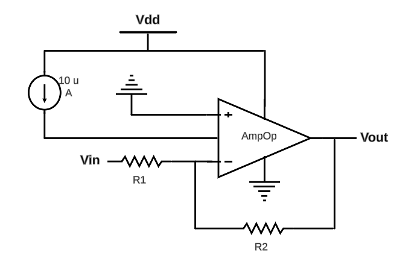

 
<h1> OpAmp - CIA 2024 </h1>

  

## Description

This repository contains an operational amplifier designed as part of the *Analog Integrated Circuits (CIA)* course, taught by Professor Dr. Cesar Augusto Prior during the first semester of 2024 in the Computer Engineering (UFSM) program.

It was my first experience with analog design and *layout* implementation.

The circuit was developed using the Virtuoso design environment and the *gpdk45* design kit.

## Applications 

-   Comparators

-   DC Amplifiers

-   Active Filters

-   Summing Amplifiers

-   Integrators / Differentiators

  

## Technical Specifications

| Property                                 | Value  | Unit        |
|:----------------------------------------:|:------:|:-----------:|
| Power Supply Voltage                     | 2      | V           |
| Power Consumption                        | 0.53   | mW          |
| DC Gain                                  | 1235   | —           |
| DC Offset                                | 1      | V           |
| CMIR (Common-Mode Input Range)          | 0 – 1.9 | V          |
| Output Swing                             | 1.9 – 0 | V          |
| Open-Loop Gain                           | 61.8   | dB          |
| Gain Margin                              | 13.91  | dB          |
| Phase Margin                             | 55.59  | degrees (°) |
| Cutoff Frequency                         | 63     | kHz         |
| GBW (Gain-Bandwidth Product)             | 77.8   | MHz         |
| CMRR (Common-Mode Rejection Ratio)       | 64.9   | dB          |
| PSRRDC (Power Supply Rejection Ratio) | 66.35  | dB          |
| Settling Time                            | 38.5   | ns          |
| Slew Rate                                | 72     | V/µs        |

## Block Diagram

*Regions 0, 1, and 2 represent cutoff, triode, and saturation, respectively.*

*C0 = 0.5pF*

## Layout

It was my very first one, so don’t expect miracles! 😅

## DC Analysis

### Gain and Offset

A DC sweep from $0 \text{V}$ to $2 \text{V}$ was applied to the non-inverting input, while the inverting input was held at a constant $1 \text{V}$ DC. 

  

 

  

### CMIR – Common-Mode Input Range

For the CMIR analysis, a unity-gain amplifier was built, in which the non-inverting input was linearly swept from $0\ \text{V}$ to $2\ \text{V}$.

  

 

  

### Output Swing 

  

 

  

## AC Analysis

For the stability and frequency response tests, the DC level of both sources was set to $1\ \text{V}$, while a frequency sweep from $1\ \text{G}$ to $10\ \text{G}$ was applied to the non-inverting input, with 10 points per decade.

  

### Stability

  

### Gain Margin

  

### Phase Margin

  

### Cutoff Frequency and GBW (Gain-Bandwidth Product)

  

The Gain-Bandwidth Product is:

$$GBW = Av_{DC} \cdot f_c = 1235 \cdot 63kHz = 77.8MHz$$

### CMRR (Common-Mode Rejection Ratio)

The frequency sweep was applied to both input signal sources.

  

 

  

### PSRR (Power Supply Rejection Ratio)

The frequency sweep was applied to the power supply.

  

 

  

# Transient Analysis

A square wave was applied to the inverting input with a period of $50\ \mu\text{s}$, rise and fall times of $20\ \text{ps}$, and a pulse width of $25\ \mu\text{s}$.

  

### Settling Time

  

### Slew Rate

  

